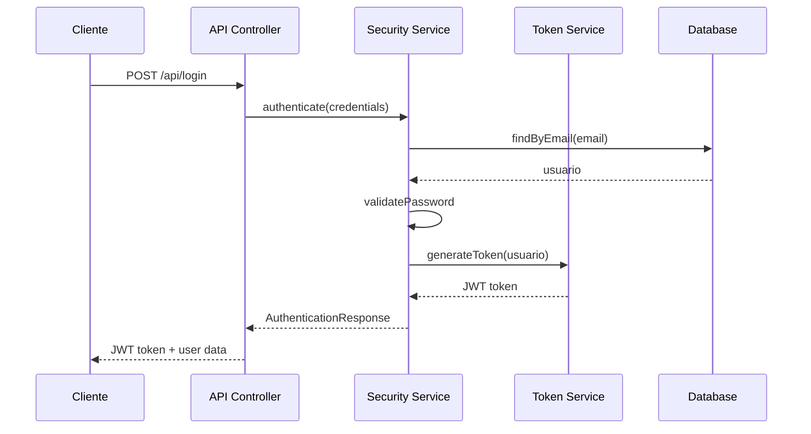
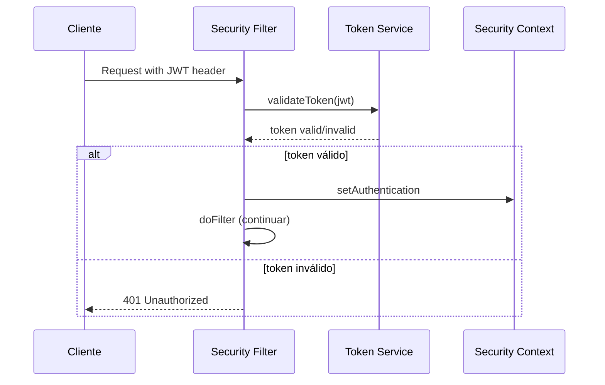

# Documentación Técnica - CUT Application

## 🏗️ Arquitectura de la Aplicación

### Patrón de Arquitectura
La aplicación sigue el patrón **MVC (Model-View-Controller)** con arquitectura en capas:

```
┌─────────────────┐
│   Controllers   │ ← Capa de Presentación
├─────────────────┤
│    Services     │ ← Capa de Lógica de Negocio
├─────────────────┤
│  Repositories   │ ← Capa de Acceso a Datos
├─────────────────┤
│    Database     │ ← Capa de Persistencia
└─────────────────┘
```

### Principios de Diseño Aplicados

#### SOLID Principles
- **S** - Single Responsibility: Cada clase tiene una responsabilidad específica
- **O** - Open/Closed: Abierto para extensión, cerrado para modificación
- **L** - Liskov Substitution: Interfaces bien definidas
- **I** - Interface Segregation: Interfaces específicas y cohesivas
- **D** - Dependency Inversion: Inyección de dependencias con Spring

#### Clean Code
- Nombres descriptivos para clases y métodos
- Funciones pequeñas y focalizadas
- Uso de DTOs para transferencia de datos
- Separación clara de responsabilidades

## 🔧 Componentes Principales

### 1. Seguridad (Security Package)

#### SecurityConfiguration
```java
@Configuration
@EnableWebSecurity
@RequiredArgsConstructor
public class SecurityConfiguration {
    // Configuración centralizada de seguridad
    // - JWT Authentication
    // - CORS Configuration
    // - Rate Limiting
    // - Endpoint Authorization
}
```

**Responsabilidades:**
- Configuración de filtros de seguridad
- Definición de endpoints públicos/privados
- Configuración CORS
- Integración con JWT

#### TokenService
```java
@Service
public class TokenService {
    // Gestión completa de tokens JWT
    // - Generación de tokens
    // - Validación de tokens
    // - Extracción de claims
    // - Manejo de expiración
}
```

**Características:**
- Tokens con expiración configurable
- Algoritmo HS256 para firma
- Claims personalizados para roles
- Validación robusta

#### SecurityFilter
```java
@Component
public class SecurityFilter extends OncePerRequestFilter {
    // Filtro personalizado para interceptar requests
    // - Extracción de JWT del header
    // - Validación de token
    // - Configuración del contexto de seguridad
}
```

### 2. Manejo de Errores (Errores Package)

#### GlobalExceptionHandler
```java
@RestControllerAdvice
public class GlobalExceptionHandler {
    // Manejo centralizado de excepciones
    // - Validation errors
    // - Security exceptions
    // - Database constraints
    // - Custom business logic errors
}
```

**Ventajas del manejo centralizado:**
- Consistencia en respuestas de error
- Logging centralizado
- Separación de concerns
- Mejor experiencia de usuario

### 3. Modelo de Datos (Modelo Package)

#### Usuario Entity
```java
@Entity
@Table(name = "usuarios")
public class Usuario implements UserDetails {
    // Entidad principal del sistema
    // - Implementa UserDetails para Spring Security
    // - Validaciones JPA
    // - Relaciones con otras entidades
}
```

**Características:**
- UUID como identificador primario
- Implementación de UserDetails
- Validaciones con Bean Validation
- Timestamps automáticos
- Soft delete con campo 'activo'

#### DTOs (Data Transfer Objects)
```java
public record DtoRegistroUsuario(
    @NotBlank String userName,
    @Email String email,
    @NotBlank String password
) {}
```

**Beneficios de los DTOs:**
- Inmutabilidad con records
- Validación automática
- Separación entre modelo interno y API
- Prevención de over/under-posting

### 4. Rate Limiting

#### RateLimitFilter
```java
@Component
public class RateLimitFilter implements Filter {
    // Control de tasa de requests por IP
    // - Cache en memoria con TTL
    // - Configuración por endpoint
    // - Respuestas HTTP 429
}
```

**Implementación:**
- Map concurrent para thread-safety
- Cleanup automático de entradas expiradas
- Configuración flexible por endpoint

## 🔄 Flujos de Trabajo

### Flujo de Autenticación


### Flujo de Autorización


## 🛠️ Configuración y Personalización

### Variables de Entorno
```properties
# Base de Datos
DB_URL=jdbc:mysql://localhost:3306/cut
DB_USERNAME=usuario
DB_PASSWORD=password

# JWT Configuration
JWT_SECRET=your-256-bit-secret-key-here
JWT_EXPIRATION=86400000  # 24 horas en millisegundos

# Rate Limiting
RATE_LIMIT_REQUESTS=100
RATE_LIMIT_WINDOW=60000  # 1 minuto en millisegundos
```

### Configuración de Spring Profiles

#### Development Profile
```properties
# application-dev.properties
spring.jpa.show-sql=true
spring.jpa.properties.hibernate.format_sql=true
logging.level.com.cut.cardona=DEBUG
```

#### Production Profile
```properties
# application-prod.properties
spring.jpa.show-sql=false
logging.level.com.cut.cardona=INFO
server.error.include-stacktrace=never
```

## 🧪 Estrategia de Testing

### Unit Tests
```java
@ExtendWith(MockitoExtension.class)
class TokenServiceTest {
    @Mock
    private UsuarioRepository repository;
    
    @InjectMocks
    private TokenService tokenService;
    
    @Test
    void shouldGenerateValidToken() {
        // Test de generación de token
    }
}
```

### Integration Tests
```java
@SpringBootTest
@AutoConfigureTestDatabase
@Transactional
class UsuarioRepositoryTest {
    @Test
    void shouldFindUserByEmail() {
        // Test de repositorio
    }
}
```

### Security Tests
```java
@SpringBootTest
@AutoConfigureMockMvc
class SecurityConfigurationTest {
    @Test
    void shouldAllowPublicEndpoints() {
        // Test de configuración de seguridad
    }
}
```

## 📊 Monitoreo y Observabilidad

### Métricas Importantes
- Tiempo de respuesta de endpoints
- Tasa de errores por endpoint
- Número de tokens generados/validados
- Rate limiting hits

### Logging Strategy
```java
@Slf4j
public class AuthenticationService {
    public void authenticate(String email) {
        log.info("Authentication attempt for user: {}", email);
        // ... lógica
        log.info("Authentication successful for user: {}", email);
    }
}
```

### Health Checks
```java
@Component
public class DatabaseHealthIndicator implements HealthIndicator {
    @Override
    public Health health() {
        // Verificación de conectividad a BD
    }
}
```

## 🔐 Mejores Prácticas de Seguridad

### 1. Gestión de Contraseñas
- BCrypt con factor de costo 12
- Validación de complejidad
- No almacenamiento en logs

### 2. JWT Security
- Secreto de al menos 256 bits
- Expiración corta (24 horas)
- Validación en cada request

### 3. Input Validation
- Validación en múltiples capas
- Sanitización de entrada
- Uso de DTOs para endpoints

### 4. Error Handling
- No exposición de información sensible
- Logging detallado para debugging
- Respuestas consistentes

## 🚀 Optimizaciones de Rendimiento

### Database
- Índices en columnas frecuentemente consultadas
- Connection pooling configurado
- Lazy loading para relaciones

### Caching
- Cache de tokens válidos
- Cache de consultas frecuentes
- TTL apropiado para cada tipo de data

### Rate Limiting
- Algoritmo token bucket
- Configuración por tipo de endpoint
- Cleanup automático de memoria
